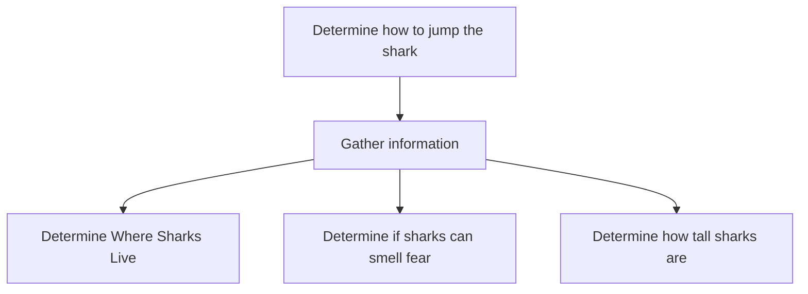
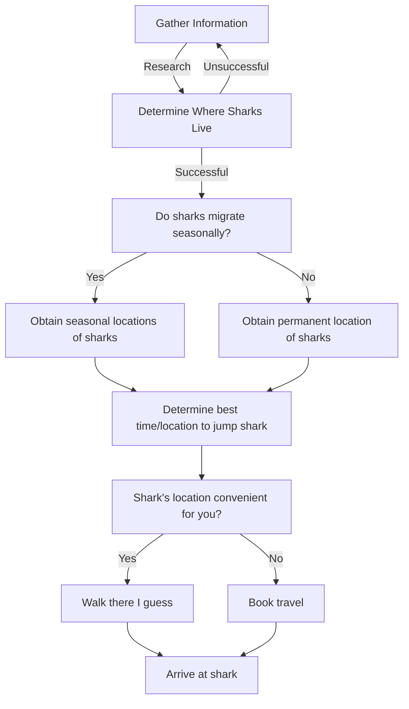
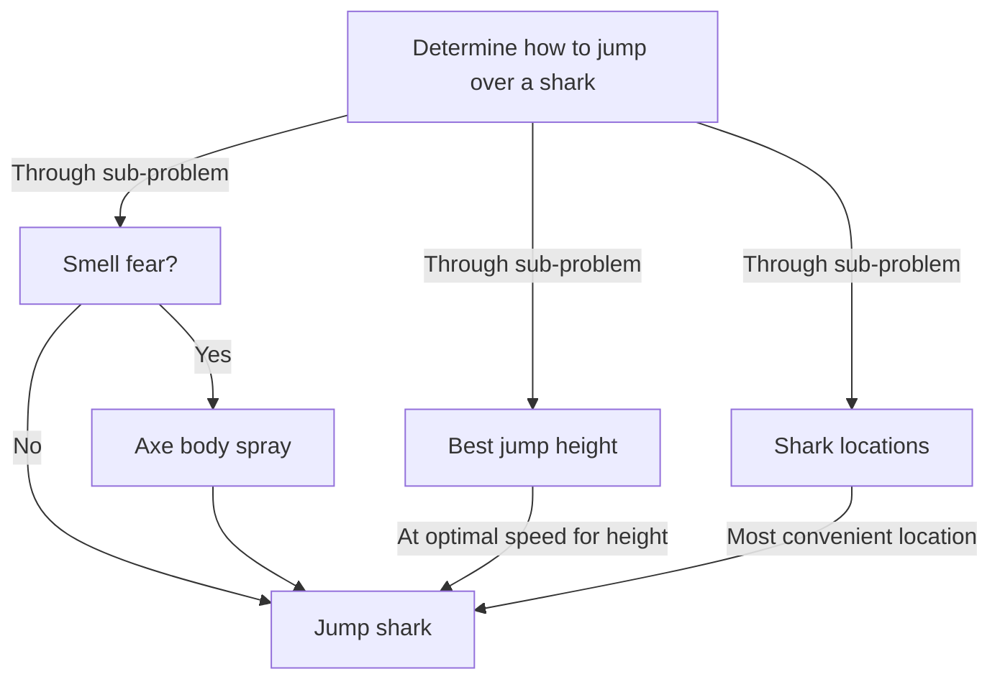

# What is Computational Thinking?

Certainly, after reading the goals of the Callysto project which included "Introduce computational thinking to K-12 students in Canada", one might be left wondering: "What exactly _is_ computational thinking? And more importantly: how does one go about _teaching_ it?". Unfortunately, if you were to prowl many of the results found by the Google search engine, you would be immersed in conflicting and ever more pedantic definitions of computational thinking. The purpose of this chapter is to help define what computational thinking means within the scope of the Callysto project, and how one might teach these concepts within a Jupyter notebook.

The general consensus around computational thinking is primarily focused on the following skills or abilities:

1. Ability to break down a problem algorithmically
    - The ability to take a large abstract problem, and break it down in to manageable pieces.
      - Modularize the problem.
      - Gather useful data/information.
    - Abstract and generalize the problem, formulate it in a different way that yields itself well to a solution.
        - Formulate the problem algorithmically.
    - Identify or generate data which is useful to the problem.
      - Are there data sets available? Are there other ways to calculate/discover the information you need?
    - Model the problem
      - How can you describe the problem in terms of discrete tasks?
2. Ability to format a general solution
    - Once the problem is broken down accordingly, take those pieces, solve them, and put them together logically into a complete solution.
    - Identify and extract important information from the solution.
3. Analysis of that solution
    - What new insights do you have based on the solutions to your problem?

It is important to notice that there was no mention of "programming", or "coding". Computational thinking within the scope of student learning is generally problem solving or testing in a way that works with technology.

> Simply put, computational thinking is “thinking (or problem solving) like a computer scientist.” It is the process of understanding a problem and expressing its solutions in such a way that a computer can potentially carry out the solution. In summary, it is the use of analytic and algorithmic concepts and strategies most closely related to computer science to: formulate, analyze and solve problems.
>
>- [Shuchi Grover](https://www.edsurge.com/news/2018-02-25-the-5th-c-of-21st-century-skills-try-computational-thinking-not-coding)

Computational thinking, more than anything, is an analysis and problem-solving methodology. This is what the Callysto project is incorporating into the K-12 curricula. To achieve this and teach computational thinking successfully you do not need to:

- Have the students or teachers write/understand code.
- Limit yourself to math and science lessons.
- Constrain yourself to traditional teaching methodologies.

Computational thinking can be taught:
- By incorporating it as a problem solving methodology in traditional lesson plans.
- Without any need to see/understand code.
- By defining/analyzing a problem as you may in order to solve the problem using a computational approach.
- By laying out algorithms which start at a problem definition, and lead to a solution.

When developing Jupyter notebooks for the Callysto project, it may be appropriate to consider "teaching students to code" as a secondary goal. The highest priority in terms of take-away lessons within your content should be teaching traditional course content in the humanities, math, science, etc. and guiding the student(s) and teacher(s) to new insights on the subject matter. This can be done in many ways such as, drawing from an open data source, or describing how you are formulating the problem to run on your computer and why you have formulated it that way.

Indeed, in any notebook you develop, solving the problem computationally to teach a lesson is _exactly_ what you will be doing. However, understanding, or even looking at, the code should not be required to understand the lesson (unless of course, learning to code is the lesson). A break down of the _thought process_ or analysis pipeline that you apply in order to solve a problem/teach a lesson should be easily accessible. By teaching traditional lesson plans this way you are not only meeting traditional curriculum outcomes (meaning that teachers will actually use it), you are doing so by demonstrating computational thinking.

## Take Aways

- not all your Jupyter notebooks need to teach the students how to code
- demonstrate your thought process while solving the problem
- how are you breaking down/formulating the problem? 
    - why did you choose to do it that way? 
    - what methods are you using and why? 
- what data is important to finding your solution? 
- which visualizations are you using and why? 

The goal of Callysto and the CanCODE initiative, is not (necessarily) to teach students how to code. The goal is to introduce students to the idea of computational thinking in relation to their standard educational goals. In this way, we are using Jupyter notebooks as a vehicle in order to demonstrate computational thinking directly. Jupyter notebooks are designed around the idea of "literate programming", meaning that it is possible to explain not only your code, but the underlying theory, directly in the notebook itself. We can teach computational thinking in a way that is understandable to students and teachers with no coding ability, but at the same time we can make the underlying routines available for the students and teachers with more technical interests. Jupyter notebooks will make it easy for you to break down a problem computationally and explain the solution process to a general audience.

## Preposterous Example of Applying Computational Thinking

Definitions can be much more understandable if demonstrated with an example. Suppose you wanted to do something completely ludicrous like imitate everyone's favorite hero, the Fonz, and jump over a shark.
>
> Historical documentation of a notable computational thinker, The Fonz, jumping a shark. How might he have applied computational thinking in order to create such a spectacular demonstration of uncompromising dominance over the forces of nature?

Assuming you know nothing about sharks, besides the obvious fact that you might have some misplaced aggression towards them, you definitely need to learn some important information before you can go jumping aquatic terrors. How would you go about turning this dream into reality? Why, computational thinking of course! Let's start with step 1 and break that problem down.

### Breaking the problem down
The first step to jumping a shark is understanding your enemy: gather information.  Where do sharks live? How tall are they? Can they smell fear? These questions represent both important pieces of data  and represent sub-problems, two important parts of the computational approach to problem solving. Writing these down as a flow chart, we may have something that appears as follows.

Notice how these sub-problems are starting to look a little bit like an algorithm, but with the added bonus that there has been no mention of the word algorithm or computational thinking. So far in this example, in principle, anyone with zero knowledge of what computational thinking is can understand how this problem has been broken down.

We could continue breaking down our path to a solution by further modularizing the problem, for example, one of our sub problems may appear as follows:

By breaking this sub-problem down even further we have been able to identify some important information about the location of sharks: we need to know if they have seasonal migration habits or not, and we've created a plan to deal with each case.  Using this information we can determine the best time to find the unsuspecting shark and jump over it. It may be fair to call this example unconventional, but it's certainly going to be both efficient and cost effective.

Certainly, this example is not realistic, but that is the point. By breaking down the problem we have used computational thinking, essentially created an algorithm: there exists a loop structure with an exit condition (the research step), conditional decision making ( `if` → `then` ) logic, and a clear path from problem definition to solution. While this example is completely absurd, we have broken a large problem down into sub-problems, organized one of those sub-problems algorithmically and in doing so used computational thinking. Most notably, we did this without mentioning any of these concepts in the main body of problem text. We are teaching core principles of computational thinking without ever mentioning that we are doing that, we are "sneak teaching".

### Format Solution

Assuming we have formulated similar workflows/processes to the other sub-problems, to complete our task of jumping a shark, it would now be possible to format a complete solution as follows:

This example shows a algorithmic way to locate, stalk, and jump, a shark. However, it is so much more than that. It provides an example of _problem abstraction_. We've taken a large and vague problem, broken it down into manageable related sub-pieces, and shown how those sub-tasks come together to create a finite path to a solution to the problem.

### Analyze solution

In this case, the analysis is left to hypotheticals. For example, if you go out and test this solution what are your metrics of success?

On the other hand, we could take this analysis even further: calculate some probabilities based on initial assumptions, and update them as you learn more. Analyze different scenarios. Are there locations where you're more likely to be successful? Different species of sharks that are shorter than others? Types of water skis that glide more efficiently through the water? In essence the analysis of our solution in this case can be written into two categories:

1. Actually jump the shark. Did you succeed? If so, your solution was acceptable.
2. Analyze different scenarios and probabilities of success. What's your probability of success at different speeds? With different sharks? With different water skis etc.

In this case we would find the method with the highest probability of success and decide if the solution was adequate based on these assumptions.

## External References

To get a better idea of computational thinking the following articles are good starting point:

- [J.M. Wing. 2006. Computational Thinking. Communications of the ACM. Vol. 49, No. 3](https://www.cs.cmu.edu/~15110-s13/Wing06-ct.pdf).
- [J.M. Wing. 2014. Computational Thinking Benefits Society. Social Issues in Computing blogpost ](http://socialissues.cs.toronto.edu/index.html%3Fp=279.html).
