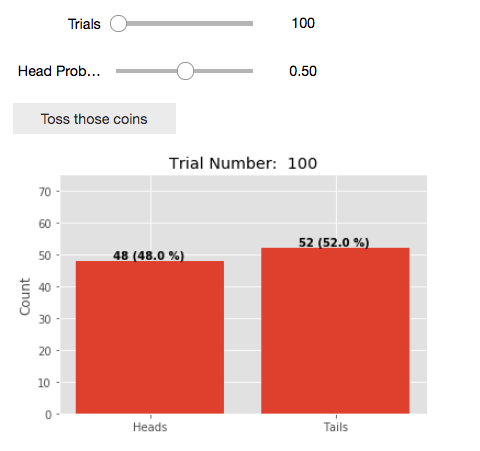

# Notebook Format

In order to maintain a consistent format across notebooks, subjects, and authors there are some formatting and structure requirements in place, outlined below.

Your notebook is likely intended to _teach_ something new. As this is the case, your notebook should contain the following points and follow this basic structure. You're free to add subsections relevant to these primary sections where applicable, however it is important that every notebook contains these five elements.

1. Introduction
 * What are you going to teach and why.
 * This section may contain background elements and subsections.
2. Background
 * Explain the subject matter you're going to be teaching
 * This section may contain examples and subsections.
3. Example(s)
 * Demonstrate what you've taught with analytic results, interactive widgets, animations, graphs and Python/R codes.  
 * This may also contain multiple subsections
4. Questions
 * Ask questions to test understanding of the material you've covered and keep the student engaged.
 * Questions may be spread throughout the document.
5. Conclusion
 * Restate important points and summarize your lesson - what did you teach and why.

Where the details behind these sections are explained below.

However, the basic format of the notebooks can be described as "Describe what you're going to teach in this notebook and why, provide further details of what you said you would teach, demonstrate what you have taught, and state those facts again."

### A Note About Visualizations
All of our demos should include eye-catching visualizations (static or interactive). For inspiration and instruction please visit our [Special Topics](special.md) section.

## Introductions
All notebooks for the Callysto project will require an introduction. In this section you will outline and motivate the content of your notebook so there is no ambiguity in regards to the content of your notebook. This is arguably the most important section of any notebook. This is the first section any student/teacher is going to read, and if your introduction is vague/bad, then the content you create is never going to get used. Below are some examples of both a bad and a good introduction

##### Bad Introduction
> In this notebook we go over how to use Python to plot functions.

This introduction is bad for a lot of reasons. Most prominently is _how_ are you going to use Python functions and _why_ is it important to learn that? As a general rule, if those two questions remain unanswered, the introduction needs some work.

##### Better Introduction

> In this notebook we will outline the use of Python's `matplotlib` libraries in order to create graphs of both data and functions. As creating graphs easily and flexibly is required for almost any serious analysis or study, it's important to understand how to use `matplotlib`. First we will outline some basic functionality of the `matplotlib` library in order to create some basic scatter plots of open source data. Once we're more comfortable with the use of `matplotlib` we will then introduce Python functions and how they can be used to plot mathematical functions using `matplotlib`. Finally, we will combine the two ideas and show you how to plot a scatter plot of data, as well as overlay a theoretical curve on that graph in order to test our model. Once you've worked your way through this notebook, you should be able to apply what you've learned to different data sets and functions.

This introduction is far superior to the last one. Not only have we introduced _what_ we're doing we've also introduced _why_ we're doing it, as well as given an overview of the topic we're going to cover. Your introduction should essentially act to both motivate the contents of the notebook, and act as a guide of what the notebook is going to cover.

### A Brief Note on "Eye Catching"

From conversations with K-12 teachers is that it may be useful to have an "eye catching" graphic in the first few lines in order to draw in your K-12 crowd. This is pretty flexible and can range from either a widget that you're going to go over how to build, to relevant YouTube videos or gifs. For example

> ## Introduction
>The rise of cryogenic technologies have been largely popularized by the work of one Philip J. Fry:
>
> 
>
>Where his groundbreaking work demonstrated the use of cryogenic freezing as a method of paradox-free unidirectional time travel...

may suffice as the first two sentences of an introduction. In this case, the "Eye Catching" graphic does **not** replace your introduction, it is simply **in addition**, or supplementary, to your introduction.

## Background and Examples

In principle a lot of the back ground can be included in the introduction, however sometimes it may be easier to write as its own section inter-weaved with various examples. With the flexibility that a Jupyter notebook provides it becomes very easy to "teach by example". Not only that, but we can make those examples interactive. The game you have to play in these sections is to not only explain the subject matter, but to also come up with some level of interactivity or visualization that will supplement the lesson. Your goal as a Callysto creator will be to demonstrate the subject matter you wish to teach by using interactive examples. See the examples below

##### Bad Example
If this was a crusty old textbook on introductory statistics, we might have an explanation and example something like this

> A coin toss has a fifty percent probability to return either heads or tails. However, this does not necessarily  translate into returning an equal number of heads and tails during experiment! For example, see th results of the Table below where in we flipped a coin some dozens of times
>
> | Number of Trials   |      Head Count      |  Tail Count |
> |----------|:-------------:|------:|
> | 10 |  3 | 7 |
> | 100 |    58   |   42 |
> |100000 |50203 |    49797 |
>
> Peculiar! Notice how we don't get exactly a 50/50 split? Do these results agree with what you'd expect? Let's introduce some equations that will help explain why...

Now to be fair that started strong. It talked about the intuitive probability behind a coin toss, as well as the idea of statistical fluctuation. However, it then demonstrates that with a boring and perhaps confusing table. With Jupyter notebooks, we have the flexibility to create something more interactive such as below

##### Better Example

> A coin toss has a fifty percent probability to return either heads or tails. However, if we were to flip a coin 100 times would we expect an equal number of heads and tails? Try it out! Click "Toss those coins" on the widget below in order to simulate some coin tosses
>
> 
>
> (Note:  This widget can be used in the Math/FlippingCoins.ipynb if you're interested)
> Now try adjusting the "Head Prob..." slider for biased coins! Do the results agree with what you'd expect? Let's introduce some equations that will help explain why...

Notice how now we have something interactive such that the student is free to run as many trials as they like in order to help understand the process. Not to mention that as we've run away from the table format, we were also free to introduce the idea of biased coins.

Essentially the name of the game is interactivity and demonstrations. If there's a way for you to explain/visualize your content in an interactive way, it is strongly encouraged that you do that. Of course the code for the interactivity may get complicated. That's okay. Feel free to to take advantage of the ability to hide blocks of code for the interactive widgets if that code went "out of scope" of what you're hoping to teach. However, it is important that you comment those codes well in case a teacher/student is curious about the underlying structure of those widgets.

Regardless, within the Jupyter notebooks you create you need to explain the background/provide examples and interactivity that will help you teach the subject matter to the students. And if that wasn't challenging enough, you have to find a way to communicate that in a way that is understandable to your K-12 audience.

## Questions

By asking questions about the lesson you're teaching throughout the notebook you will keep the students engaged and thinking about the content you have created. This will also help with the adoption of your content in the classroom as it will have more of a textbook/assignment feel. As an added bonus, the questions you're asking is a great way to test the quality of your explanations and content. Does the answer to the question you've asked not naturally develop form your explanations and examples? If not, you might consider refining your explanations such that no one can read one of your questions and react with complete bewilderment. As well, these questions can be open-ended and need not always be quantitative. Using this document as an example, some examples of bad and good questions are as follows

##### Bad Question
> Why is whoever wrote this notebook so adamant about showing us good and bad examples? Why don't they just get on with it?

This is a bad question because no where in the document have we discussed why I'm showing you so many examples, I've just been doing it. In this case, you the student, have no context or prior knowledge of this question, making it unfair and difficult to answer.

##### Better Question
> Does this notebook try to use both interactivity and examples as a teaching tool? Where was it successful and where was it not?

This is a better question as the notebook itself has provided you with the tools to answer this question yourself. Actually it would be great to get feedback on this question in order to improve this template.

## Conclusions
No notebook is complete without a conclusion. In this section you will summarize what you taught in the notebook, and how it might be useful in the future. This section not only helps "end" the notebook in a way that reiterates important points to the student, but it also acts as a sanity check for you to make sure you covered everything you wanted to. For example, back to our `matplotlib` introduction example, a bad conclusion would be

##### Bad Conclusion
> This notebook showed you how to use `matplotlib`.

First and foremost, a conclusion is not a sentence. This conclusion tells you nothing. What is the takeaway from a notebook has tried to teach? Why is it useful?

##### Better Conclusion
> This notebook has demonstrated some of the basics of the `matplotlib` library and Python functions in order to create graphs of both data and functions. We covered the basic syntax of `matpotlib` in order to create scatter plots, as well as how to use Python functions in order to visualize the trace of mathematical functions. This introduction will help you create your own graphics for other research projects, and should help you be prepared for more complicated visualizations in the future such as three dimensional plots and animations.

This is a lot better. Not only does it tell you what we learned in our theoretical notebook (notice how it parrots the introduction), it also tells you how this notebook will be useful in the future. A conclusion like this not only wraps up the lesson, it also lays out potential future learning objectives.

## Conclusion

In conclusion the basic outline of a notebook for Callysto is as follows

1. Introduction and Background
 * Describe what your notebook discusses and give some background information.
 * Be sure to include an "Eye Catching" graphic in the beginning of the notebook.
2. Examples
 * Teach the content you mentioned in your introduction. Use interactive widgets and animations to help "teach by example". Where applicable also use Python/R examples.
3. Include questions throughout/in its own section in order to engage the student/make it easier for a teacher to use your notebook.
4. Conclusion
* Reiterate important learning objectives that you covered and explain where this knowledge is helpful.

There is quite a lot of freedom surrounding these points/how you end up organizing things that will certainly depend notebook to notebook. However, these four main points are required to be covered in every notebook. Any notebook that does not contain these elements will be considered incomplete.

​
